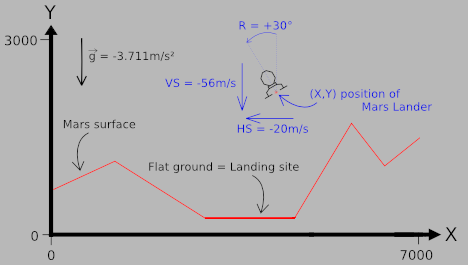
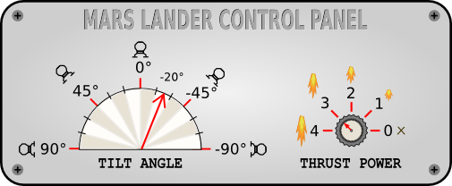

#Rules

Built as a game, the simulator puts Mars Lander on a limited zone of Mars sky.

The zone is 7000m wide and 3000m high. There is a unique area of flat ground on the surface of Mars, which is at least 1000 meters wide.

Every second, depending on the current flight parameters (location, speed, fuel ...), the program must provide the new desired tilt angle and thrust power of Mars Lander: angle goes from `-90° to 90°`; thrust power goes from `0 to 4`.

The game simulates a free fall without atmosphere. Gravity on Mars is `3.711 m/s²`. For a thrust power of X, a push force equivalent to X m/s² is generated and X liters of fuel are consumed. As such, a thrust power of 4 in an almost vertical position is needed to compensate for the gravity on Mars.

For a landing to be successful, the ship must:

 * land on flat ground
 * land in a vertical position (tilt angle = 0°)
 * vertical speed must be limited ( ≤ 40m/s in absolute value)
 * horizontal speed must be limited ( ≤ 20m/s in absolute value)

The program must first read the initialization data from standard input. Then, within an infinite loop, the program must read the data from the standard input related to Mars Lander's current state and provide to the standard output the instructions to move Mars Lander.

----

### Initialization input

Line 1:
: the number surfaceN of points used to draw the surface of Mars.

Next surfaceN lines:
: a couple of integers landX landY providing the coordinates of a ground point. By linking all the points together in a sequential fashion, you form the surface of Mars which is composed of several segments. For the first point, `landX = 0` and for the last point, `landX = 6999`

### Input for one game turn

A single line with 7 integers:
: X Y hSpeed vSpeed fuel rotate power. _X,Y_ are the coordinates of Mars Lander (in meters). _hSpeed_ and _vSpeed_ are the horizontal and vertical speed of Mars Lander (in m/s). These can be negative depending on the direction of Mars Lander. _fuel_ is the remaining quantity of fuel in liters. _*When there is no more fuel, the power of thrusters falls to zero.*_ _rotate_ is the angle of rotation of Mars Lander expressed in degrees. _power_ is the thrust power of the landing ship.

### Output for one game turn

A single line with 2 integers:
: rotate power. _rotate_ is the desired rotation angle for Mars Lander. Please note that for each turn the actual value of the angle is limited to the value of the previous turn `+/- 15°`.
_power_ is the desired thrust power. 0 = off. 4 = maximum power. Please note that for each turn the value of the actual power is limited to the value of the previous turn `+/- 1`.

----

### Constraints

    2 ≤ surfaceN < 30
    0 ≤ X < 7000
    0 ≤ Y < 3000
    -500 < hSpeed, vSpeed < 500
    0 ≤ fuel ≤ 2000
    -90 ≤ rotate ≤ 90
    0 ≤ power ≤ 4
    Response time per turn ≤ 100ms